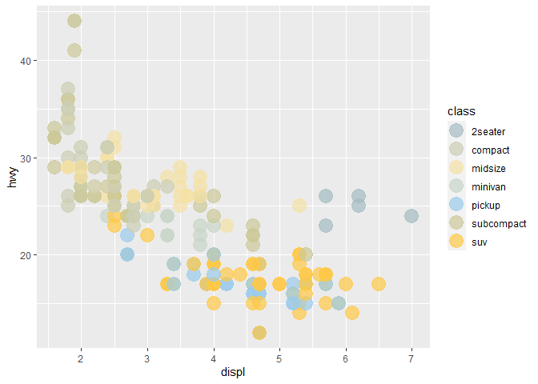
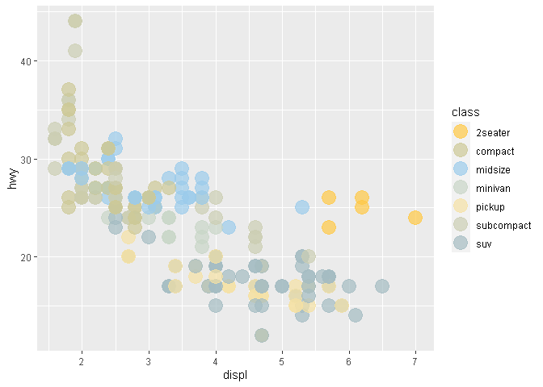
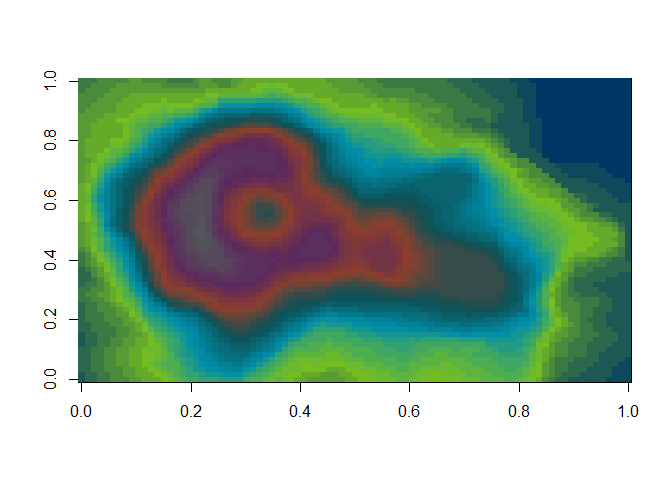

# MN Color Palettes

Use the `mncolors` package to paint your data with colors from the [MN
state brand style
guide](https://mn.gov/portal/brand/style-guide/colors/), and a few color
palettes inspired by local landscapes and animals, such as tree frogs
and crayfish.

Use the palettes with `ggplot2` or `plot` to give your charts some MN
style.

## Install

To install `mncolors`:

``` r
# First install the 'remotes' package
install.packages("remotes")

# Now you can install mncolors from github
remotes::install_github("tidy-MN/mncolors")
```

## The Palettes

There are currently 13: primary, accent, extended, blue, green, gray,
safety, **primary_accent**, **primary_extended**,
**primary_accent_extended**, corn, treefrog, and caryfish.


<br>

**More specifically:**

``` r
mn_palettes
```

    ## $primary
    ##   MN Blue  MN Green 
    ## "#003865" "#78BE21" 
    ## 
    ## $accent
    ## [1] "#008EAA" "#0D5257" "#8D3F2B" "#5D295F" "#53565A"
    ## 
    ## $extended
    ## [1] "#A4BCC2" "#F5E1A4" "#9BCBEB" "#FFC845"
    ## 
    ## $blue
    ## [1] "#D9D9D6" "#A4BCC2" "#9BCBEB" "#008EAA" "#003865"
    ## 
    ## $green
    ## [1] "#D9D9D6" "#A4BCC2" "#0D5257" "#78BE21"
    ## 
    ## $gray
    ## [1] "#53565A" "#97999B" "#D9D9D6"
    ## 
    ## $safety
    ## [1] "#A6192E" "#E57200"
    ## 
    ## $primary_accent
    ##   MN Blue  MN Green                                                   
    ## "#003865" "#78BE21" "#008EAA" "#0D5257" "#8D3F2B" "#5D295F" "#53565A" 
    ## 
    ## $primary_extended
    ##   MN Blue  MN Green                                         
    ## "#003865" "#78BE21" "#A4BCC2" "#F5E1A4" "#9BCBEB" "#FFC845" 
    ## 
    ## $primary_accent_extended
    ##   MN Blue  MN Green                                                             
    ## "#003865" "#78BE21" "#008EAA" "#0D5257" "#8D3F2B" "#5D295F" "#53565A" "#A4BCC2" 
    ##                               
    ## "#F5E1A4" "#9BCBEB" "#FFC845" 
    ## 
    ## $corn
    ## [1] "#78BE21" "#FFC845"
    ## 
    ## $treefrog
    ## [1] "#53412B" "#474F27" "#96B02C" "#94AD81" "#BFC453"
    ## 
    ## $crayfish
    ## [1] "#832D12" "#34424A" "#6C5E2E" "#AB8237" "#5493AA"

## Examples

In a ggplot use the MN palettes with the `scale_fill_mn()` and
`scale_color_mn()` functions.

``` r
library(mncolors)
library(ggplot2)

# Primary
ggplot(data = mpg) +   
   geom_point(aes(x = displ, y = hwy, color = class), size = 6, alpha = 0.7) +
   scale_color_mn(palette = "primary", reverse = TRUE)
```

<!-- -->

``` r
# Extended
ggplot(data = mpg) +   
   geom_point(aes(x = displ, y = hwy, color = class), size = 6, alpha = 0.7) +
   scale_color_mn(palette = "extended")
```

<!-- -->

``` r
# Primary + Accent
ggplot(diamonds) + 
  geom_bar(aes(x = cut, fill = clarity)) +
  scale_fill_mn(palette = "primary_accent")
```

<!-- -->

``` r
# Crayfish
ggplot(diamonds) + 
  geom_col(aes(y = mean(price), x = cut, fill = cut)) +
  scale_fill_mn(palette = "crayfish")
```

<!-- -->

Alternatively, use`mncolors()` to feed a specific number of colors from
a palette to a ggplot layer.

``` r
library(ggplot2)

df <- dplyr::starwars[1:5, ]

ggplot(df, aes(x = height, y = reorder(name, height), fill = height)) +
    geom_col() + 
    scale_fill_gradientn(colors = mncolors(5, palette = "primary")) +
  theme(legend.position = "none") +
  labs(title = "How tall are they?",
       subtitle = "Star Wars character heights",
       x = "height (cm)",
       y = "")
```

<!-- -->

## Lots of colors!

Enter any number you want to `mncolors()` to return a bucket of colors.

``` r
mncolors(10, "blue")
```

    ##  [1] "#D9D9D6FF" "#B0BEB9FF" "#A4BABDFF" "#A7C4D4FF" "#A5CCE8FF" "#89C4E5FF"
    ##  [7] "#4EAAC8FF" "#0084A0FF" "#005D7DFF" "#003865FF"

<!-- -->

``` r
mncolors(100, "green")
```

<!-- -->

## Base plots

In this example we use the `primary_accent` palette directly via the
`colorRampPalette()` function.

``` r
# Volcano example

## Create palette
pal <- colorRampPalette(mn_palettes$primary_accent)

## Use 50 colors from it
image(volcano, col = pal(50))
```

<!-- -->
